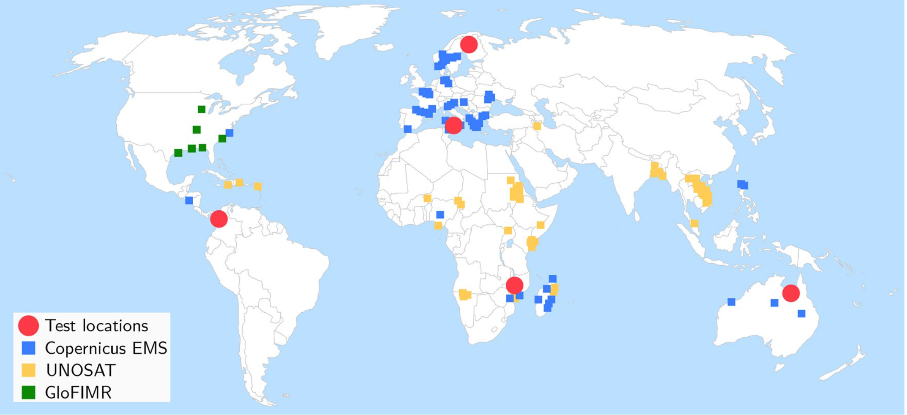

# Semantic-segmentation-of-flood-event-satellite-imagery
Bachelor's thesis.

It started from the paper "Towards global flood mapping onboard low cost satellites with machine learning" published on Nature, the dataset WorldFloods2021 and it aims at improving their models or at developing new methods for the semantic segmentation of flood event satellite images.

Link to download the dataset (nearly 300 GB): https://tinyurl.com/worldfloods

The dataset contains pairs of Sentinel-2 images and flood extent maps covering 119 global flood events that occurred between November 2015 and March 2019 in different locations of the world.

In particular, it contains 422 flood extent maps created by photo-interpretation either manually or semi-automatically, so each flood extent map belongs to a flood event hence a flood event could have several flood maps which may cover diferent areas of interest or different days of the same area in the same flood event; in
total the dataset covers 119 floods events 
